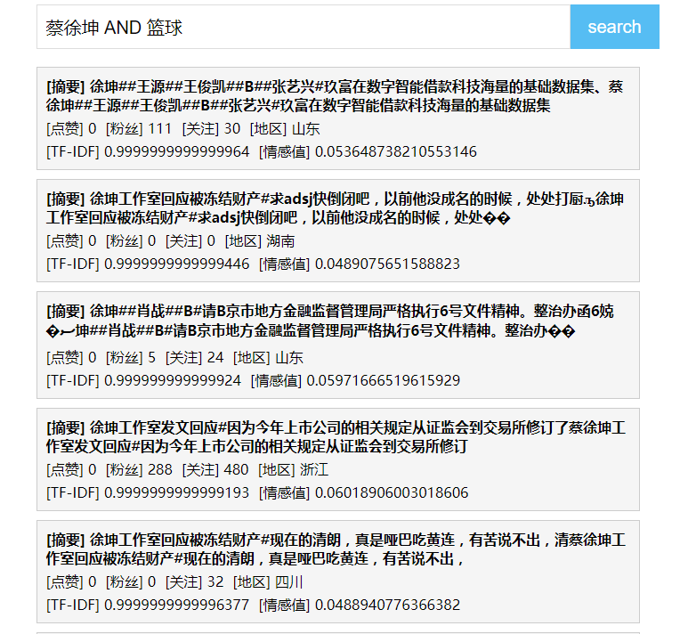
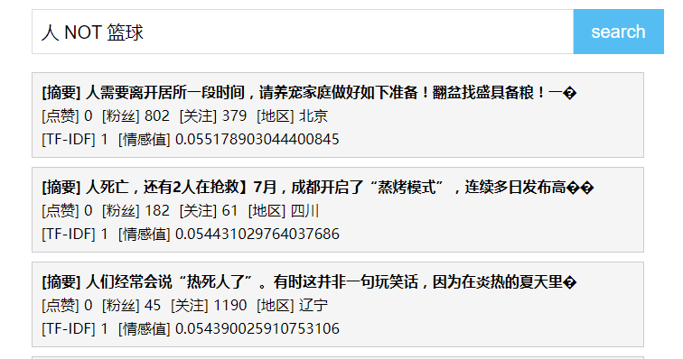

## 简易微博事件搜索引擎实现

- 数据分析部分实现：[微博新传媒比赛-全国三等奖](https://github.com/Simon006/data_minig_contest_new_media)

## 搜索关键步骤实现

预处理阶段：
- 使用cppjieba对每个微博事件进行分词
- 分词后计算每个事件的词频，并且根据情感词典计算每个事件的情感倾向分
- 根据TF-IDF计算每个词在其出现的事件中的影响权重

实际搜索阶段：
- 解析出搜索语句中的关键字：`AND`，`OR`，`NOT`
- 按照搜索关键字分割搜索语句，并进行搜索，三个关键字分别对应搜索结果求交集、并集、非集
- 将搜索语句视为一个事件，对其进行分词，计算词频、情感得分
- 初筛：筛选出拥有搜索语句中所有词语的事件，并选出情感倾向与搜索语句相同的事件
- 再筛：根据搜索语句的每个词语的权重值构成向量，再计算与备选集的余弦相似度，选取最相似的前k个返回
- 根据搜索结果的事件ID，生成摘要并返回结果
- redis 缓存

字典树实现前缀搜索
- MapReduce 模式，从多个单词文件构建字典树
- 字典树 DictTree，实现前缀搜索，保证线程安全
- 每个节点记录当前节点是否是一个单词的末尾，及所有子节点路径

## 结果示例







Log 日志：
```txt
2023-11-10 17:06:15,951: INFO rootCategory : Log init success
2023-11-10 17:06:17,226: INFO rootCategory : cppjieba init!
2023-11-10 17:06:21,692: INFO rootCategory : 停词库，情感词表，网页库，偏移库，倒排索引库，情感得分表 读取数据成功!
2023-11-10 17:06:28,979: INFO rootCategory : >>client has connected 127.0.0.1:9006 >> 127.0.0.1:34133
2023-11-10 17:06:28,979: INFO rootCategory : search event: 蔡徐坤
2023-11-10 17:06:28,980: INFO rootCategory : redis key exists: 蔡徐坤
2023-11-10 17:06:28,980: INFO rootCategory : >>client has broken up 127.0.0.1:9006 >> 127.0.0.1:34133
...
```

## 细节

##### 前端

- 前端简单写的页面，用apache搭载，详见`frontend文件夹`
- 后端返回`json`数据，前端用`jquery`进行解析渲染

##### 单 Reactor 多线程模式

- net 中实现 Reactor 相关、TCPConnection 相关；由 Acceptor 负责主线程连接相关，监听新的连接请求；回调函数挂载到 TCPConnection 上，由 EventLoop 从 epoll 中取出可操作的 socket 句柄，再调用 TCPConnection 中的回调函数进行处理；
- threadpool 实现线程池，由回调函数中将业务处理函数添加到线程池的任务队列中，是和 Server 分离开的，不影响 Server 主线程监听连接；
- `using Task = function<void()>;` 定义了添加到线程池任务队列的数据类型，是一个可调用对象（函数、函数指针、lambda表达式等皆可）

##### redis 缓存

- 单例模式实现，将搜索语句与结果的JSON语句存储到缓存中
- 在计算搜索匹配结果、词频、情感前先从缓存中查找有没有相应的key（即搜索语句文本），有则直接返回
- 用于搜索运算消耗较大，使用缓存可以很好提高性能

##### log 日志

- 基于`log4cpp`实现日志，单例模式
- 在头文件中定义相应的宏，以实现简单调用日志接口

#### 搜索细节

- 关键字分割搜索语句，不同关键字对应不同的搜索结果合并
- 首先搜索出包含搜索文本每个词的事件，并依据情感得分去除情感倾向不同的结果
- 根据搜索规则匹配，合并得到搜索结果
- 根据搜索语句的TF-IDF向量与搜索结果事件的向量计算余弦相似度并排序
- 最终生成摘要并返回结果

#### 字典树 与 MapReduce 构建
- 字典树实现：每个节点记录自身的字符、是否是一个词的结束、所有子节点的路径
- MapReduce 实现：每个单词文件新建一个线程读取，向字典树中添加单词信息，Reducer 负责统计单词数量（通过是单词结束的节点的数量）；


##### 依赖库

- cppjieba：常用中文分词库
- limonp：cppjieba中依赖的
- jsoncpp：json相关实现
