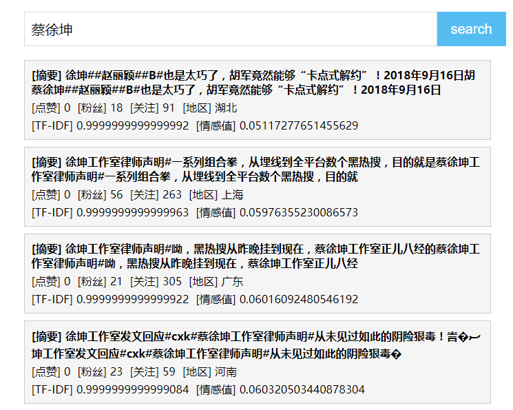
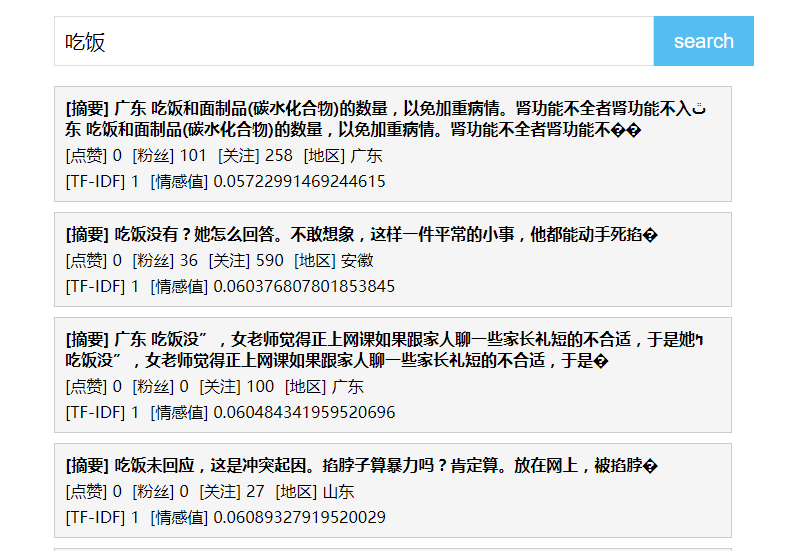

## 简易微博事件搜索引擎实现

- 数据分析部分实现：[微博新传媒比赛-全国三等奖](https://github.com/Simon006/data_minig_contest_new_media)

## 搜索关键步骤实现

预处理阶段：
- 使用cppjieba对每个微博事件进行分词
- 分词后计算每个事件的词频，并且根据情感词典计算每个事件的情感倾向分
- 根据TF-IDF计算每个词在其出现的事件中的影响权重

实际搜索阶段：
- 将搜索语句视为一个事件，对其进行分词，计算词频、情感得分
- 初筛：筛选出拥有搜索语句中所有词语的事件，并选出情感倾向与搜索语句相同的事件
- 最终：根据搜索语句的每个词语的权重值构成向量，再计算与备选集的余弦相似度，选取最相似的前k个返回

## 结果示例






Log 日志：
```txt
2023-11-10 17:06:15,951: INFO rootCategory : Log init success
2023-11-10 17:06:17,226: INFO rootCategory : cppjieba init!
2023-11-10 17:06:21,692: INFO rootCategory : 停词库，情感词表，网页库，偏移库，倒排索引库，情感得分表 读取数据成功!
2023-11-10 17:06:28,979: INFO rootCategory : >>client has connected 127.0.0.1:9006 >> 127.0.0.1:34133
2023-11-10 17:06:28,979: INFO rootCategory : search event: 蔡徐坤
2023-11-10 17:06:28,980: INFO rootCategory : redis key exists: 蔡徐坤
2023-11-10 17:06:28,980: INFO rootCategory : >>client has broken up 127.0.0.1:9006 >> 127.0.0.1:34133
...
```

## 细节

##### 前端

- 前端简单写的页面，用apache搭载，详见`frontend文件夹`
- 后端返回`json`数据，前端用`jquery`进行解析渲染

##### redis 缓存

- 单例模式实现，将搜索语句与结果的JSON语句存储到缓存中
- 在计算词频、情感前先从缓存中查找有没有相应的key（即搜索语句文本），有则直接返回
- 用于搜索运算消耗较大，使用缓存可以很好提高性能

##### log 日志

- 基于`log4cpp`实现日志，单例模式
- 在头文件中定义相应的宏，以实现简单调用日志接口

##### 网络线程池

- socket网络编程、IO多路复用
- 基于互斥锁机制实现线程池，进行网络请求的监听以及具体接口操作

##### 依赖库

- cppjieba：常用中文分词库
- limonp：cppjieba中依赖的
- jsoncpp：json相关实现
